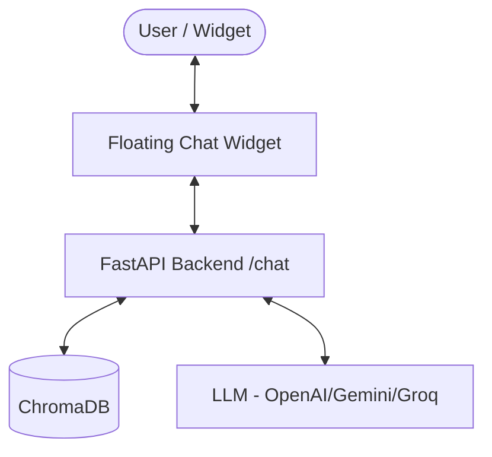

# 🤖 RAG Assistant

> **A production-ready Retrieval-Augmented Generation (RAG) system** built with FAST API, LangChain, and a premium embeddable web widget.

[](https://fastapi.tiangolo.com/)
[](https://langchain.com/)
[](https://trychroma.com/)

---

## 🌟 Overview

The RAG Assistant allows you to chat with your documents. It uses advanced vector search to find relevant information and an LLM (like GPT-4, Gemini, or Groq) to generate accurate, context-aware answers.

### ✨ Key Features
- ✅ **Strict Knowledge Grounding**: Answers only from your provided documents.
- 💬 **Contextual Chat**: Maintains session-based history for follow-up questions.
- 🎨 **Premium UI**: Modern, glassmorphic floating widget with typing indicators.
- ⚡ **Scalable Backend**: Built with FastAPI for high-performance async processing.
- 📊 **Observability**: Structured JSON logging for monitoring and debugging.
- 🛠️ **Developer Friendly**: Easy setup, clean code, and fully runnable locally.

---

## 🏗️ Architecture



---

## 📂 Project Structure

```text
├── backend/                # FastAPI backend
│   ├── app/
│   │   ├── api/             # API routes & endpoints
│   │   ├── core/            # RAG engine & LLM logic
│   │   ├── logging/         # Structured JSON logging
│   │   ├── models/          # Pydantic schemas
│   │   ├── retrieval/       # Vector DB & chunking
│   │   └── sessions/        # Session management
│   ├── chroma_db/           # Persistent vector database
│   └── logs/                # System & Chat logs
├── frontend/
│   ├── widget/              # Premium styling & logic
│   └── demo/                # Local testing page
├── knowledge_base/
│   └── raw/                 # 📂 DROP YOUR FILES HERE
├── scripts/                 # CLI tools for ingestion & reset
└── README.md
```

---

## 🚀 Quick Start

### 1. Environment Setup
```bash
# Clone the repository
git clone https://github.com/bhaskarneerati/rag-assistant.git
cd rag-assistant

# Create & activate virtual environment
python3.11 -m venv .venv
source .venv/bin/activate  # Linux/macOS
# .venv\Scripts\activate   # Windows

# Install dependencies
pip install -r requirements.txt
```

### 2. Configuration
Copy `.env.example` to `.env` and add your API key:
```bash
cp .env.example .env
# Open .env and set:
# OPENAI_API_KEY=sk-...
# OR
# GOOGLE_API_KEY=...
```

### 3. Knowledge Ingestion
Place your `.txt` files in `knowledge_base/raw/`, then run:
```bash
PYTHONPATH=backend python scripts/ingest.py
```

### 4. Launch the Server
```bash
# Standard mode
PYTHONPATH=backend uvicorn app.main:app --reload

# Debug mode (Detailed logs)
PYTHONPATH=backend uvicorn app.main:app --reload --log-level debug
```

- **API Docs**: [http://localhost:8000/docs](http://localhost:8000/docs)
- **Health Check**: [http://localhost:8000/health](http://localhost:8000/health)

### 5. Open the Demo
Simply open `frontend/demo/index.html` in your browser to start chatting!

---

## 🛠️ Customization

### Embedding the Widget
Add this single line to any HTML page:
```html
<script src="frontend/widget/embed.js"></script>
```

### Resetting the Database
To wipe the vector store and start fresh:
```bash
python scripts/reset_db.py
```

---

## ⚖️ Performance & Logs
The system generates structured logs in `backend/logs/`. You can monitor:
- `rag_engine.jsonl`: Prompt construction and LLM usage.
- `vectordb.jsonl`: Search performance and similarity scores.
- `session_manager.jsonl`: User interaction patterns.

---

<p align="center">
  Built for clarity, correctness, and real-world relevance.
</p>
