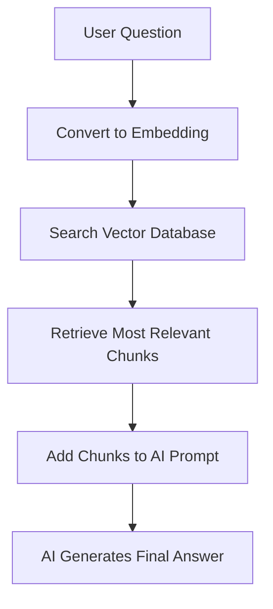
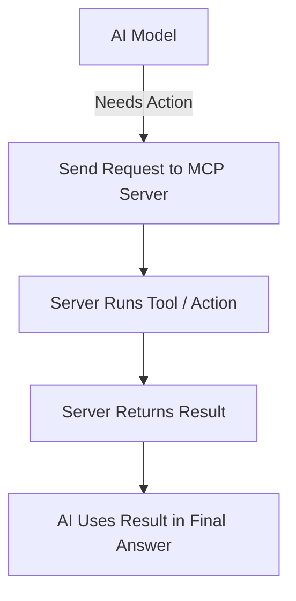
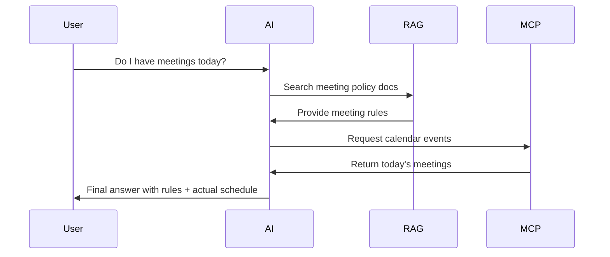
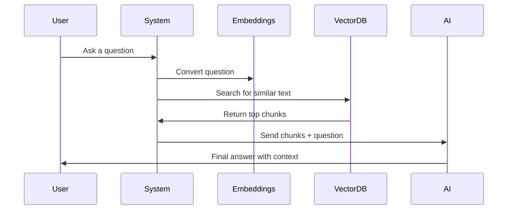
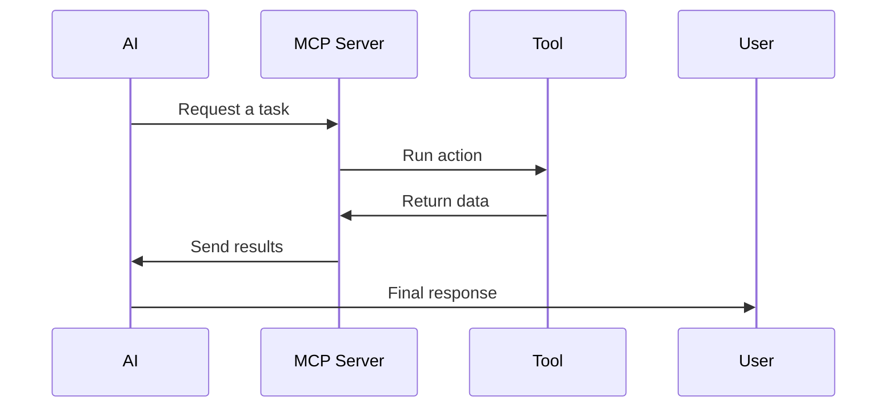

# RAG & MCP – Beginner Notes
A simple and clear introduction based on the freeCodeCamp crash course (published on 22 Jan 2026), with extra definitions added for beginners.

## 📘 Overview
Beginner-friendly notes on RAG (Retrieval-Augmented Generation) and MCP (Model Context Protocol).

These notes are based on the freeCodeCamp crash course:
- Course Page: https://www.freecodecamp.org/news/learn-rag-and-mcp-fundamentals/
- YouTube Video: https://www.youtube.com/watch?v=I7_WXKhyGms

Additional definitions and explanations are included to make learning even easier.

## 📚 Contents

    1. What is RAG?
    2. Why RAG Is Useful
	3. What is MCP?
	4. RAG vs MCP
	5. Why Use Both Together
	6. Important AI Terms (Simple Definitions)
	7. RAG Workflow (Step-by-Step)
	8. MCP Workflow (Step-by-Step)
	9. Final Summary

All content is designed for beginners.

---

## 1. What is RAG?
RAG means Retrieval-Augmented Generation.
It helps an AI system answer questions by finding correct information from your documents before generating a reply.

#### RAG Flow Diagram

#### Key Points
- AI does not guess. It searches first.
- It converts your question into embeddings (a number list that represents meaning).
- It finds the closest or most similar text chunks in your document database.
- It sends these chunks to the AI model as context.
- This reduces wrong answers (hallucinations).
- Very useful for large documents like manuals, guides, PDFs, or policies.

#### Simple idea

RAG = the AI reads your documents before answering.

## 2. Why RAG Is Useful
- Answers come from your data, not from random memory.
- Works great for support bots, knowledge bases, and internal tools.
- Makes the system more reliable, accurate, and trustworthy.

## 3. What is MCP?

MCP means Model Context Protocol.
It is a framework that helps AI talk to tools, software, and real systems using a standard method.

#### MCP Flow Diagram

#### Key Points
- AI can use calendars, databases, APIs, file systems, and commands.
- No need to write new integration code every time.
- You can create your own MCP server, which exposes actions or tools.
- The server runs these tasks and gives results back to the AI.

#### Simple idea

MCP = the AI can use tools and perform actions.

## 4. RAG vs MCP

| Concept | What It Does | When Used |
|---|---|---|
| RAG | Gives AI the right information from documents | To answer questions with correct context |
| MCP | Lets AI interact with tools or systems| To fetch live data or perform actions |

#### Simple
- RAG = knowledge
- MCP = abilities

## 5. Why Use RAG + MCP Together?

Using both makes the AI:
- Smarter (because it reads your documents)
- More useful (because it can act using tools)
- Able to give answers based on real facts and also perform real tasks

Example
- RAG: Reads your company’s meeting policy.
- MCP: Checks your actual calendar events.

#### Combined Example Diagram

Together:

“Do I have meetings today?”

→ AI gives real answer using calendar + explains meeting rules if needed.

## 6. Important Terms (Simple Definitions)

#### Embedding

A list of numbers that represents the meaning of text.
Used so computers can compare text by looking at numbers.

#### Vector Database

A special database that stores embeddings.
Helps AI quickly find similar text based on meaning, not just keywords.

#### Chunking

Breaking a long document into smaller pieces so the AI can find the most relevant parts easily.

#### Prompt

The message or input given to an AI model.
In RAG, the prompt includes both the question and the retrieved text chunks.

#### Context Window

The amount of text an AI model can read at one time.
RAG helps fit the most important parts into this window.

#### Protocol

A set of rules that allows systems to communicate with each other.
MCP is a protocol for AI-to-tool communication.

#### Tool / Action

A defined operation an AI can call through MCP, like:
- “search files”
- “check calendar”
- “read database”
- “run command”

## 7. RAG Workflow (Simple Version)
	1. User asks a question.
	2. System converts question to an embedding.
	3. It searches the vector database for similar text chunks.
	4. It adds those chunks to the AI prompt.
	5. AI answers using those chunks as verified context.

## 8. MCP Workflow (Simple Version)
	1. AI decides it needs outside data or needs to perform a task.
	2. AI sends a request to the MCP server.
	3. MCP server runs the action (API call, tool, database check).
	4. Server returns results to the AI.
	5. AI uses that result to create the final answer.

## 9. Final One-Line Summary
- RAG helps the AI read your data correctly.
- MCP helps the AI act using real tools.
- Together they create practical, real-world AI systems.

## 💡 Useful For
- Students learning AI
- Developers starting with RAG or Agentic AI
- Anyone curious about MCP
- People building chatbots, assistants, or AI tools
